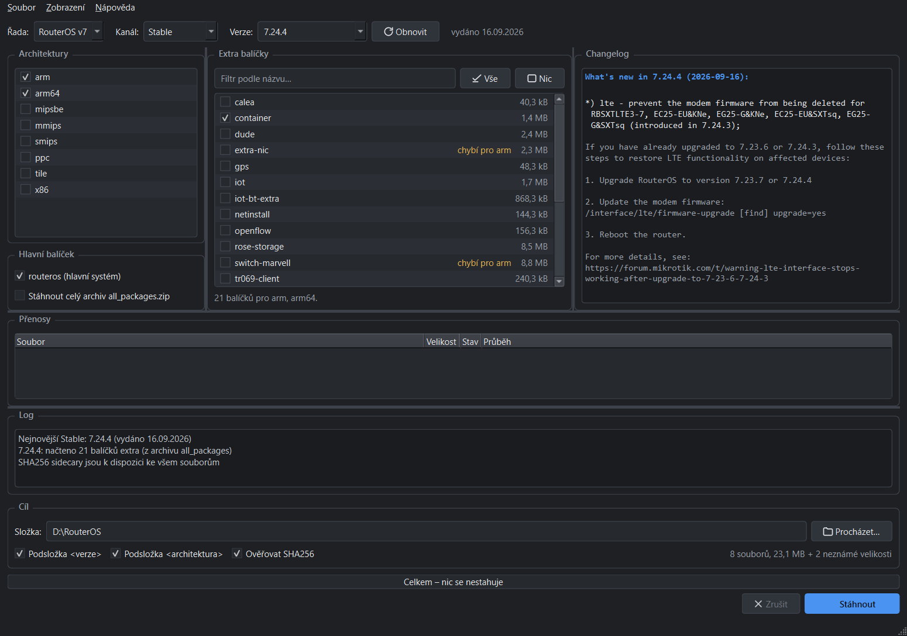

# RosDownloader

Desktopová aplikace pro Windows, která stahuje balíčky **MikroTik RouterOS (`*.npk`)**
z oficiálních zdrojů MikroTiku. Vybereš řadu, kanál, verzi, jednu nebo víc
architektur a balíčky – aplikace zbytek zařídí, včetně ověření SHA256.



## Co umí

- **Nejnovější verze se načte sama** hned po spuštění (výchozí je v7 stable).
- Řady **v7 i v6**, kanály stable / long-term / testing / development
  (v6 má jen stable a long-term – víc jich MikroTik nepublikuje).
- **Historie verzí** včetně bet a rc, s možností napsat verzi ručně.
- **Více architektur naráz** – seznam extra balíčků se zobrazí jako sjednocení
  a u každého balíčku je vidět, pro které architektury chybí.
- Seznam extra balíčků se zjišťuje **dynamicky**, ne z pevného seznamu v kódu:
  přes HTTP Range se přečte jen konec archivu `all_packages` (~66 kB místo 50 MB).
- **Ověření SHA256** u každého souboru proti sidecaru, který MikroTik publikuje.
- Stahování do `.part`, **navazování na přerušené přenosy**, max 3 soubory naráz,
  3 pokusy s prodlevou, ukazatel průběhu pro každý soubor zvlášť i celkový.
- **Změna motivu za běhu** (Systém / Světlý / Tmavý) včetně titulkového pruhu okna.
- Panel s changelogem vybrané verze.
- Nastavení a cache v `%APPDATA%\RosDownloader\`.

## Instalace

Stáhni `RosDownloader.exe` z [posledního releasu](https://github.com/johnnybee05/RouterOS_Download_App/releases/latest)
a spusť. Jeden soubor, **nepotřebuje nainstalovaný Python** ani nic dalšího.

Windows SmartScreen soubor nejspíš zablokuje – není podepsaný certifikátem.
*Více informací → Přesto spustit*, nebo si ho sestav sám podle
[Sestavení ze zdrojáků](#sestavení-ze-zdrojáků) níže.

Stažený soubor si můžeš ověřit proti SHA256 uvedenému u releasu:

```powershell
Get-FileHash .\RosDownloader.exe -Algorithm SHA256
```

## Použití

1. Vlevo nahoře zvol **řadu** (v7 / v6) a **kanál**. Verze se doplní sama,
   v poli Verze si můžeš vybrat starší nebo ji napsat ručně (`7.20.3`, `7.25beta5`).
2. V seznamu **Architektury** zaškrtni jednu nebo víc (`arm64`, `x86`, …).
   Nejsi si jistý? Na routeru `/system resource print`, řádek `architecture-name`.
3. Nech zaškrtnuté **routeros (hlavní systém)** a přidej extra balíčky
   (`container`, `wifi-qcom`, `user-manager`, …). Filtr nahoře hledá podle názvu,
   tlačítka **Vše** / **Nic** zaškrtnou to, co je zrovna vidět.
4. Dole zadej **cílovou složku**. Volitelně se soubory rovnou roztřídí
   do `<cíl>\<verze>\<architektura>\`.
5. **Stáhnout**. Průběh je vidět u každého souboru zvlášť, celkový ukazatel
   a rychlost jsou dole. **Zrušit** stahování kdykoli přeruší – hotové soubory
   zůstanou, nedokončené jako `.part` a příště se na ně naváže.

### Motiv

**Zobrazení → Motiv**: Systém / Světlý / Tmavý. Výchozí je Systém, kdy aplikace
sleduje nastavení Windows a na jeho změnu reaguje okamžitě, bez restartu.
Volba se ukládá do nastavení.

### Kde se co ukládá

| Soubor | Obsah |
|---|---|
| `%APPDATA%\RosDownloader\settings.json` | poslední volby, cílová složka, motiv, geometrie okna |
| `%APPDATA%\RosDownloader\versions.json` | cache seznamu verzí (platnost 24 h) |
| `%APPDATA%\RosDownloader\packages.json` | cache seznamu balíčků pro verzi a architekturu |

Tlačítko **Obnovit** obě cache zahodí a načte všechno znovu.

## CLI

Jádro jde ovládat i bez GUI – hodí se na skriptování a na ladění:

```bash
python -m rosdl newest                          # nejnovější verze ve všech kanálech
python -m rosdl --major 6 newest
python -m rosdl versions                        # historie verzí
python -m rosdl changelog 7.24.4
python -m rosdl packages --arch arm64           # extra balíčky pro verzi a architekturu
python -m rosdl urls --arch arm64,x86 --main    # jen vypsat URL, nestahovat
python -m rosdl download --arch arm64 --main --extra container,wifi-qcom --out D:\ros --per-version --per-arch
```

Užitečné přepínače: `--channel development`, `--no-cache` (globální, před podpříkazem),
`--jobs N`, `--no-verify`.

## Sestavení ze zdrojáků

Potřebuješ **Python 3.12+ z python.org**. Python z Microsoft Storu nestačí –
PyInstaller se nedostane k jeho souborům v `C:\Program Files\WindowsApps`
a build selže; `build.ps1` na to upozorní sám.

```powershell
powershell -ExecutionPolicy Bypass -File .\build.ps1
```

Skript vytvoří `.venv`, nainstaluje závislosti, pustí testy, vygeneruje ikonu
a sestaví `dist\RosDownloader.exe` (jeden soubor, cca 52 MB).

Přepínače: `-Clean` (od nuly), `-SkipTests`, `-Console` (konzolová varianta
pro ladění), `-Python <cesta>` (konkrétní interpret).

### Vývoj

```powershell
py -3.14 -m venv .venv
.\.venv\Scripts\python -m pip install -r requirements-dev.txt
.\.venv\Scripts\python -m pytest tests -q
.\.venv\Scripts\python main.py          # GUI ze zdrojáků
```

## Struktura projektu

```
rosdl/
  core/            jádro bez závislosti na Qt
    urls.py        sestavování URL (pravidla v6/v7, x86, powerpc)
    client.py      NEWEST, changelog, historie verzí, seznam balíčků
    zipindex.py    čtení ZIP Central Directory přes HTTP Range
    downloader.py  stahování, .part, opakování, SHA256
    config.py      nastavení v %APPDATA%
    cache.py       JSON cache s TTL
  gui/             PySide6
    theme.py       palety, přepínání motivu, tmavý titulkový pruh
    main_window.py okno
    workers.py     vlákna na pozadí (QRunnable + signály)
    widgets.py     seznam s checkboxy, tabulka přenosů, log
  cli.py           python -m rosdl
tests/             pytest s mockovaným HTTP
tools/             recon.py (ověření endpointů), make_icon.py
docs/ENDPOINTS.md  ověřená struktura URL MikroTiku
build.ps1          sestavení .exe
```

Veškerá síťová komunikace běží mimo GUI vlákno (`QThreadPool` + signály),
takže okno nezamrzá ani při stahování padesátimegového archivu.

## Poznámky ke zdrojům MikroTiku

Podrobnosti a důkazy jsou v [docs/ENDPOINTS.md](docs/ENDPOINTS.md). Tři věci,
které zaskočí skoro každého, kdo si URL skládá podle oka:

- **v7 `x86` nemá v hlavním balíčku příponu architektury** – `routeros-7.24.4.npk`,
  zatímco `routeros-7.24.4-x86.npk` je 404.
- **v6 `x86` příponu naopak má** – `routeros-x86-6.49.22.npk`.
- **v6 PowerPC se v hlavním balíčku jmenuje `powerpc`**, ale archiv a extra
  balíčky používají `ppc`.

Seznam verzí se zjišťuje sondáží na `CHANGELOG`, protože stránka
`mikrotik.com/download` je Livewire aplikace, která seznam dotahuje až AJAXem –
bez prohlížeče se z HTML vyčíst nedá.

## Licence

Aplikace stahuje soubory z veřejných serverů MikroTiku a nijak je neupravuje.
Na samotné balíčky RouterOS se vztahují licenční podmínky MikroTiku.
